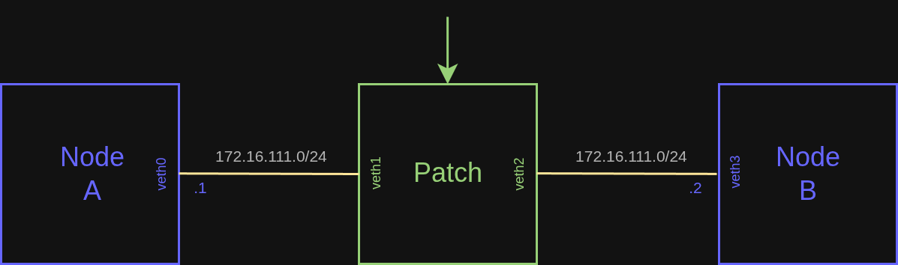

# L2 Virtual Patch (with XDP, single-thread)

A demonstation of a virtual patch between two nodes.

## Topology diagram


## Steps

### Build the project (all examples)
```bash
cd packetcord.io
mkdir build
cd build
cmake -DENABLE_XDP_DATAPLANE=ON .. --fresh
make
```

### Start the test deployment

```bash
cd ..
cd apps/l2_xdp_patch/test_deployment/
sudo ./deploy.sh
```

### Go to the shell of Patch
```bash
docker exec -it patch /bin/sh
```

Inside the container, run the following commands and leave the shell open:
```bash
cd /root
./l2_xdp_patch_app
```

### Result
Open the shells of Node A and Node B. Try to ping each other (172.16.111.1 and 172.16.111.2).

```bash
docker exec -it node_a /bin/sh
```

```bash
docker exec -it node_b /bin/sh
```

```console
PING 172.16.111.1 (172.16.111.1): 56 data bytes
64 bytes from 172.16.111.1: seq=0 ttl=64 time=0.087 ms
64 bytes from 172.16.111.1: seq=1 ttl=64 time=0.076 ms
64 bytes from 172.16.111.1: seq=2 ttl=64 time=0.075 ms
64 bytes from 172.16.111.1: seq=3 ttl=64 time=0.086 ms
```

Let's also run iperf3 between Node A (server) and Node B (client):

#### On Node A
```bash
iperf3 -s
```

#### On Node B
```bash
iperf3 -c 172.16.111.1
```

```console
Connecting to host 172.16.111.1, port 5201
[  5] local 172.16.111.2 port 47300 connected to 172.16.111.1 port 5201
[ ID] Interval           Transfer     Bitrate         Retr  Cwnd
[  5]   0.00-1.00   sec   464 MBytes  3.89 Gbits/sec   31    646 KBytes       
[  5]   1.00-2.00   sec   559 MBytes  4.69 Gbits/sec   12    665 KBytes       
[  5]   2.00-3.00   sec   560 MBytes  4.70 Gbits/sec   17    675 KBytes       
[  5]   3.00-4.00   sec   558 MBytes  4.68 Gbits/sec   12    706 KBytes       
[  5]   4.00-5.00   sec   560 MBytes  4.70 Gbits/sec   21    512 KBytes       
[  5]   5.00-6.00   sec   557 MBytes  4.68 Gbits/sec   17    513 KBytes       
[  5]   6.00-7.00   sec   558 MBytes  4.68 Gbits/sec   22    523 KBytes       
[  5]   7.00-8.00   sec   556 MBytes  4.66 Gbits/sec   17    551 KBytes       
[  5]   8.00-9.00   sec   556 MBytes  4.67 Gbits/sec   17    568 KBytes       
[  5]   9.00-10.00  sec   559 MBytes  4.69 Gbits/sec   12    601 KBytes       
- - - - - - - - - - - - - - - - - - - - - - - - -
[ ID] Interval           Transfer     Bitrate         Retr
[  5]   0.00-10.00  sec  5.36 GBytes  4.61 Gbits/sec  178            sender
[  5]   0.00-10.00  sec  5.36 GBytes  4.60 Gbits/sec                 receiver
```

## Destroy the test deployment
Close all container shells. On the host, inside the l2_xdp_patch/test_deployment directory, execute:
```bash
sudo ./cleanup.sh
```