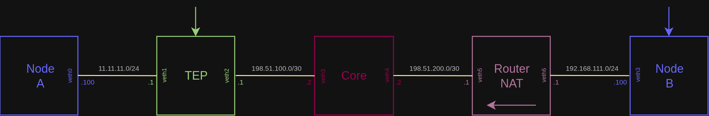

# L3 Pseudo Tunnel

We demonstrate how to send a UDP-in-UDP crafted packet from Node-B to the internal network of Node A (the 11.11.11.0/24 subnet).

## Topology diagram


## Steps

### Build the project (all examples)
```bash
cd packetcord.io
mkdir build
cd build
cmake .. --fresh
make
```

### Start the test test deployment

```bash
cd ..
cd apps/l3_pseudo_tunnel/test_deployment/
sudo ./deploy.sh
```

### Go to the shell of Node A
```bash
docker exec -it node_a /bin/sh
```

Inside the container, run the following netcat command and leave the shell open:
```bash
nc -n -u -l -p 8765 -s 11.11.11.100 -v
```

### Go to the shell of TEP (use new terminal window)
```bash
docker exec -it tep /bin/sh
```
Inside the container, run the following commands and leave the shell open:
```bash
cd /root
./l3_pseudo_tunnel_tep_app
```

The pseudo tunnel TEP should start with the following log:
```console
[CordApp] Launching the PacketCord Pseudo Tunnel!
[CordL4UdpFlowPoint] Successfully bound to port 50000
```

### Go to the shell of Node B (use new terminal window)
```bash
docker exec -it node_b /bin/sh
```

Inside the container, run the following commands:
```bash
cd /root
./l3_pseudo_tunnel_client_app
```

And the log on the console should be:
```console
[CordApp] Transmitting the crafted pseudo-tunnel packet...
[CordApp] Destroying all objects!
```

## Result
Open the tab with with the Node A shell. You should see the following:
```console
# nc -n -u -l -p 8765 -s 11.11.11.100 -v
Bound on 11.11.11.100 8765
Connection received on 192.168.111.100 1234
PacketCord.io Tunneled Hello!!!
```

The "PacketCord.io Tunneled Hello!!!" string has been sent Successfully over the UDP pseudo tunnel.

### Destroy the test test deployment
Close all container shells. On the host, inside the l3_pseudo_tunnel/test_deployment directory, execute:
```bash
sudo ./cleanup.sh
```