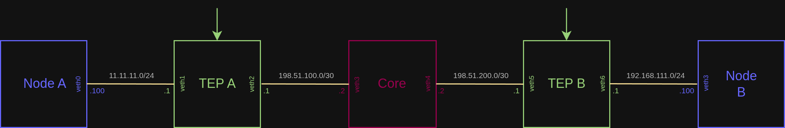

# L3 Pseudo Tunnel

A demonstation of an IPv4 tunnel (over UDP) between the Node A and Node B subnets.

## Topology diagram


## Steps

### Build the project (all examples)
```bash
cd packetcord.io
mkdir build
cd build
cmake .. --fresh
make
```

### Start the test deployment

```bash
cd ..
cd apps/l3_tunnel/test_deployment/
sudo ./deploy.sh
```

### Go to the shell of TEP A
```bash
docker exec -it tep_a /bin/sh
```

Inside the container, run the following netcat command and leave the shell open:
```bash
cd /root
./l3_tunnel_tep_a_app
```

### Go to the shell of TEP B (use new terminal window)
```bash
docker exec -it tep_b /bin/sh
```
Inside the container, run the following commands and leave the shell open:
```bash
cd /root
./l3_tunnel_tep_b_app
```

### Result
Open the shell of Node A and Node B. Try to ping each other (11.11.11.100 and 192.168.111.100).

```bash
docker exec -it node_b /bin/sh
```

```bash
docker exec -it node_b /bin/sh
```

```console
PING 11.11.11.100 (11.11.11.100): 56 data bytes
64 bytes from 11.11.11.100: seq=0 ttl=64 time=0.334 ms
64 bytes from 11.11.11.100: seq=1 ttl=64 time=0.117 ms
```

We can also run iperf3 test - let's make the Node A the server Node B the client.

#### On Node A
```bash
iperf3 -s
```

#### On Node B
```bash
iperf3 -c 11.11.11.100
```

```console
Connecting to host 11.11.11.100, port 5201
[  5] local 192.168.111.100 port 45230 connected to 11.11.11.100 port 5201
[ ID] Interval           Transfer     Bitrate         Retr  Cwnd
[  5]   0.00-1.00   sec   158 MBytes  1.32 Gbits/sec  645    130 KBytes       
[  5]   1.00-2.00   sec   180 MBytes  1.51 Gbits/sec  804    128 KBytes       
[  5]   2.00-3.00   sec   182 MBytes  1.52 Gbits/sec  804    124 KBytes       
[  5]   3.00-4.00   sec   179 MBytes  1.51 Gbits/sec  736    126 KBytes       
[  5]   4.00-5.00   sec   181 MBytes  1.52 Gbits/sec  829    115 KBytes       
[  5]   5.00-6.00   sec   176 MBytes  1.48 Gbits/sec  820    127 KBytes       
[  5]   6.00-7.00   sec   179 MBytes  1.50 Gbits/sec  785    116 KBytes       
[  5]   7.00-8.00   sec   182 MBytes  1.53 Gbits/sec  883    126 KBytes       
[  5]   8.00-9.00   sec   182 MBytes  1.52 Gbits/sec  836    119 KBytes       
[  5]   9.00-10.00  sec   182 MBytes  1.53 Gbits/sec  905    127 KBytes       
- - - - - - - - - - - - - - - - - - - - - - - - -
[ ID] Interval           Transfer     Bitrate         Retr
[  5]   0.00-10.00  sec  1.74 GBytes  1.49 Gbits/sec  8047            sender
[  5]   0.00-10.00  sec  1.74 GBytes  1.49 Gbits/sec                  receiver
```

## Destroy the test test deployment
Close all container shells. On the host, inside the l3_tunnel/test_deployment directory, execute:
```bash
sudo ./cleanup.sh
```